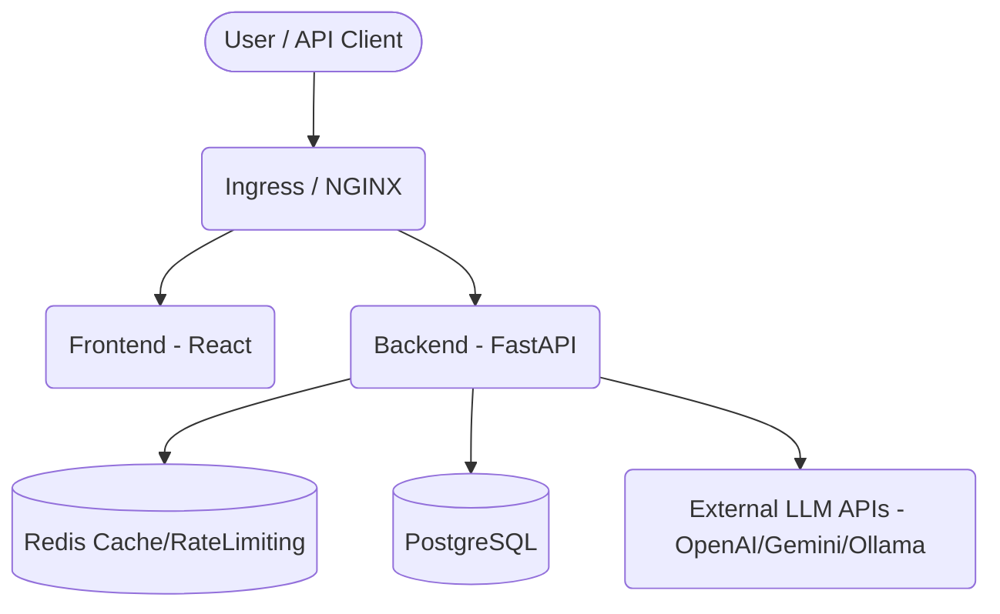

# SecureAI Gateway

SecureAI Gateway is a platform for managing, proxying, and monitoring LLM API usage.

## Architecture

## Getting Started

### Local Development (Docker Compose)
1. Copy `.env.example` to `.env` and fill in your keys.
2. Run `make dev`.
3. Open http://localhost:5173 for frontend, http://localhost:8000/docs for backend.

### Kubernetes Deployment (k3d)
1. Ensure `k3d` and `kubectl` are installed.
2. Run `make deploy`.
3. Open http://localhost:8080.

## API Documentation

Available at `/docs` when running the backend. Includes routes for:
- Authentication (`/api/v1/auth`)
- Chat (`/api/v1/chat`)
- Analytics (`/api/v1/analytics`)
- Admin (`/api/v1/admin`)
